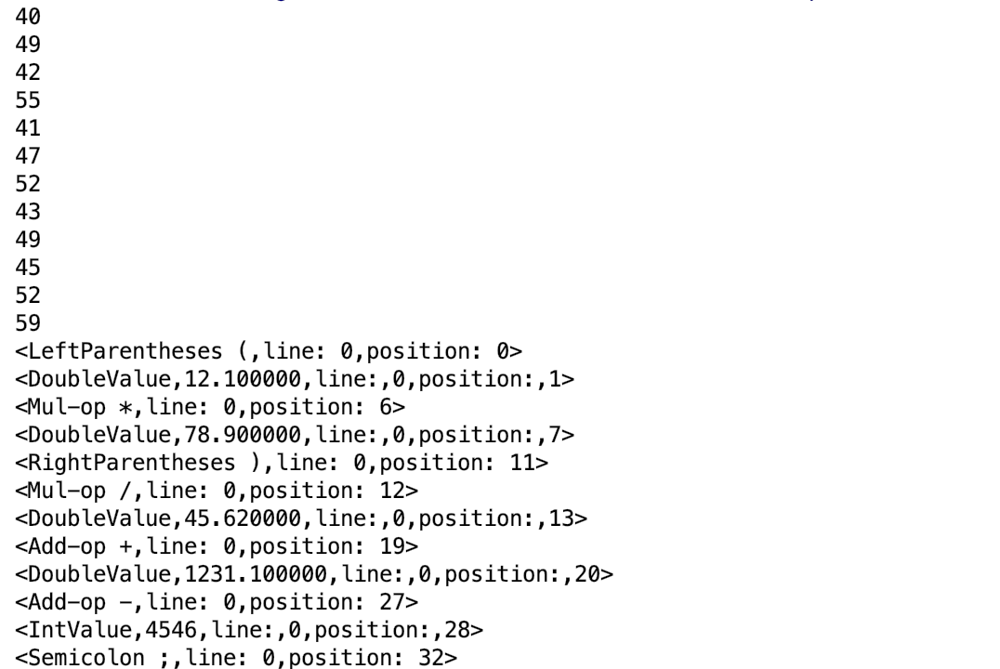
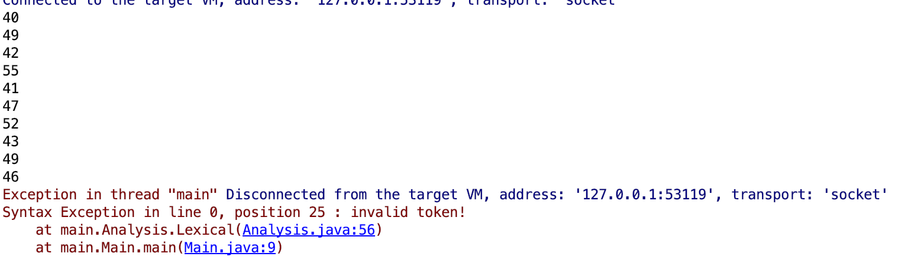
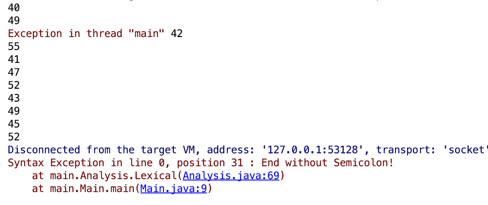

# CalculatorLexicalAnalysis

### Student Info

李斯琪 2016302580006

程浩宇 2016302580002

杜会远 2016302580130

## CMM综述：

CMM是一种简单的类型编程语言，其支持整数、实数、字符、字符串、布尔值类型的变量。每行代码的结尾标识为; ，暂无其他格式要求，冗余的空白字符会被解释器忽略。

## 词法规则

- 整数

```
digit ::= 0|1|2|3|4|5|6|7|8|9
integer ::= digit*
```

- 布尔值

```
boolean ::= true|false
```

- 标识符

```
alphabet ::= [a-z]|[A-Z]
identifier_body ::= alphabet|'_'|digit
identifier_head ::= alphabet|'_'
identifier ::= identifier_head identifier_body*
```

- 双精度浮点数

```
double ::= digit*.dight*
```

- 字符串

```
ASCII ::= ASCII码0-255(256个值)
char ::= 'ASCII'
String ::= "ASCII*"
```

- 操作符

```
add-op ::= '+'|'-'
mul-op ::= '*'|'/'|'%'
bool-op ::= '&&'|'||'|'=='|'!='|'>'|'<'|'>='|'<='
Assign-op ::= '='|'+='|'-='|'*='
```
- 分隔符
```
Separator ::= '{'|'}'|'['|']'|'('|')'|'''|'"'|':'|';'
```
- 保留字

```
if
else
while
for
true
false
int
bool
double
char
String
print
```


## 语法规则

- 语句

```
Program ::= stmt-sequence
stmt-sequence ::= statement|stmt-sequence|ε 
statement ::= assign-stmt|declare-stmt
```

- 声明语句

```
declare-stmt ::= Variable-stmt|initialization-stmt
type ::= int|bool|double|string|char
Variable-stmt ::= type identifier（下一步支持声明多个变量）
initial-stmt ::= type identifier '=' (variable|expression)
```

- 赋值语句

```
value ::= integer|boolean|double|String|char 
variable ::= value|identifier
assign-stmt ::= identifier Assign-op (variable|expression)
```

- 输出语句

``` 
output-stmt ::= print(value)
```

- 表达式

```
expression ::= arithmetic-expression|bool-expression 
arithmetic-expression ::= factor arithmetic-op factor|factor
bool-expression ::= factor bool-op factor|factor
factor ::= (exprssion)|variable
arithmetic-op ::= add-op|mul-op
```

- 控制语句

```
if-statement ::= if (experssion) {statement-sequence} else {statement-sequence}
while-statement ::= while (experssion) {statement-sequence}
for-statement ::= for (initial-stmt;bool-expression;assign-stmt) {statement-sequence}
```

## 支持

- 支持0和正整数，正浮点数，布尔值
- 支持加法操作符，乘法操作符，赋值操作符，布尔运算符，复合操作符
- 支持字符和字符串，分别用‘  ‘和 “ ”作为标识
- 支持 ( ) , { } , [ ] 三种括号，以及 : 和 ;
- 支持 if , else, while, for 等关键字 并且只要与关键字字母组合相同(无视字母大小写)的标识符都将视为非法
- 支持以大小写字母和 _ 符号起始，接字母, _ , digit的标识符

## 异常处理

- 采用ArrayList作为基础数据结构，解决了检索越界问题，定义previous函数可以向前检索
- 自定义SyntaxException类，继承自Exception，在遇到不属于任一类的字符的时候会抛出错误，并指出所在行数和在行中的位置
- SynatxException类也可以解决两个小数点相接问题
- 解决了整数数值太大的溢出问题，现在会抛出错误

## 编码表

| 编码表   |        |          |        |          |        |
| -------- | ------ | -------- | ------ | -------- | ------ |
| 单词符号 | 种别码 | 单词符号 | 种别码 | 单词符号 | 种别码 |
| If       | 1      | /        | 16     | }        | 31     |
| else     | 2      | %        | 17     | [        | 32     |
| while    | 3      | &&       | 18     | ]        | 33     |
| true     | 4      | \|\|     | 19     | (        | 34     |
| false    | 5      | ==       | 20     | )        | 35     |
| for      | 6      | !=       | 21     | ‘        | 36     |
| int      | 7      | >        | 22     | “        | 37     |
| bool     | 8      | <        | 23     | :        | 38     |
| double   | 9      | >=       | 24     | ;        | 39     |
| char     | 10     | <=       | 25     | _        | 40     |
| String   | 11     | =        | 26     | 字符串   | 41     |
| print    | 12     | +=       | 27     | 整数     | 42     |
| +        | 13     | -=       | 28     | 浮点数   | 43     |
| -        | 14     | *=       | 29     |          |        |
| *        | 15     | {        | 30     |          |        |

##  用例

```
(12.1*78.9)/45.62+1231.1-4546;
```



```
(12.1*78.9)/45.62+12.31.1-4546;
```




```
(12.1*78.9)/45.62+1231.1-4546
```

