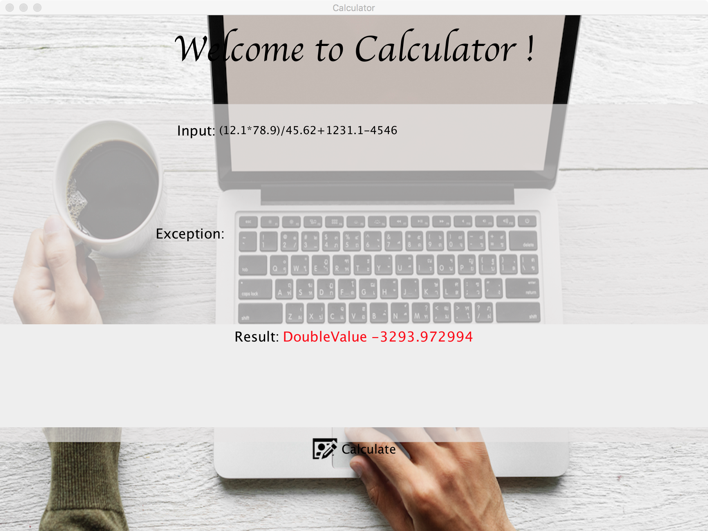
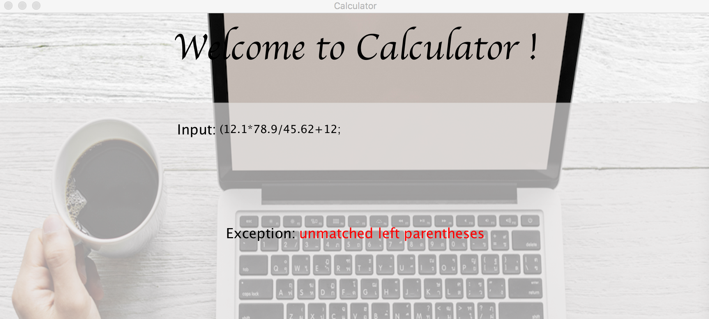

# CalculatorLexicalAnalysis

### Student Info

李斯琪 2016302580006

程浩宇 2016302580002

杜会远 2016302580130


## CMM综述：

CMM是一种简单的类型编程语言，其支持整数、实数、字符、字符串、布尔值类型的变量。每行代码的结尾标识为; ，暂无其他格式要求，冗余的空白字符会被解释器忽略。


## 词法规则

- 整数

```
digit ::= 0|1|2|3|4|5|6|7|8|9
integer ::= digit*
```

- 布尔值

```
boolean ::= true|false
```

- 标识符

```
alphabet ::= [a-z]|[A-Z]
identifier_body ::= alphabet|'_'|digit
identifier_head ::= alphabet|'_'
identifier ::= identifier_head identifier_body*
```

- 双精度浮点数

```
double ::= digit*.dight*
```

- 字符串

```
ASCII ::= ASCII码0-255(256个值)
char ::= 'ASCII'
String ::= "ASCII*"
```

- 操作符

```
add-op ::= '+'|'-'
mul-op ::= '*'|'/'|'%'
bool-op ::= '&&'|'||'|'=='|'!='|'>'|'<'|'>='|'<='
Assign-op ::= '='|'+='|'-='|'*='|'++'|'--'

```
- 分隔符
```
Separator ::= '{'|'}'|'['|']'|'('|')'|'''|'"'|':'|';'
```
- 保留字

```
if
else
while
for
true
false
int
bool
double
char
String
print
return
void
```

- 注释

```
//this is a comment.
/*this is also
a comment */
```


## 语法规则

- 语句

```
Program ::= stmt-sequence
stmt-sequence ::= statement stmt-sequence|ε 
statement ::= assign-stmt|declare-stmt|initial-stmt|output-stmt
```

- 声明语句

```
declare-stmt ::= type identifier(,identifier)+;
type ::= int|bool|double|string|char
initial-stmt ::= type identifier '=' factor;
```

- 赋值语句

```
value ::= integer|boolean|double|String|char 
assign-stmt ::= identifier Assign-op factor
```

- 输出语句

``` 
output-stmt ::= print(value)
```

- 表达式

```
expression ::= factor op factor | factor
bool-expression ::= factor bool-op factor | factor
factor ::= value|identifier|(exprssion)
op ::= add-op|mul-op|bool-op 
布尔值运算暂时不与算术运算相混合，后期可以考虑做casting false转化为0 true转化为1
```

- 控制语句

```
if-statement ::= if (experssion) {statement-sequence} else {statement-sequence}
while-statement ::= while (experssion) {statement-sequence}
for-statement ::= for (initial-stmt;bool-expression;assign-stmt) {statement-sequence}
```


## 支持

- 支持0和整数 (含负数），正浮点数，布尔值
- 支持加法操作符，乘法操作符，赋值操作符，布尔运算符，复合操作符
- 支持字符和字符串，分别用‘  ‘和 “ ”作为标识
- 支持 ( ) , { } , [ ] 三种括号，以及 : 和 ;
- 支持 if , else, while, for 等关键字 并且只要与关键字字母组合相同(无视字母大小写)的标识符都将视为非法
- 支持以大小写字母和 _ 符号起始，接字母, _ , digit的标识符
- 支持含double和int类型的算术表达式的计算


## 异常处理

- 采用ArrayList作为基础数据结构，解决了检索越界问题，定义previous函数可以向前检索

- 自定义SyntaxException类，继承自Exception，在遇到不属于任一类的字符的时候会抛出错误，并指出所在行数和在行中的位置

- SynatxException类也可以解决两个小数点相接问题

  > 2018.10.27

- 改写了整数数值太大溢出问题的判定方式，现在会准确抛出错误

- 每一行必须以；符号结尾，并且同一句应该写在一行内，语句不可跨行

- 修正了line 和 position的输出。现在line从1开始遇换行符加一，position始终打印出token的尾位置

- 改写了每行是否有分号结尾的判断方式，现在line可以正常显示

  > 2018.10.30

- 增加了gitignore，解决了ide之间的兼容问题，整个项目更加洁净

- fix了之前遗留的关于line的一个小bug，并统一了输出格式

  > 2018.10.31

- 增加了对字母中有空白的判断，增加了对数字中有空白的判断，现在会throw出exception

- 增加了+ + 和 - -的判断，方便写for语句

- 修正了数字和字母连接在一起，会被判断成两个token的问题，现在会throw出exception，因为标识符不可以以数字开头

- keyword中间有空白，也会

- 完善各种词法的测试用例

  > 2018.11.13

- 语法分析表达式部分基本完工，增添了负数部分

- GUI界面也已做好，先能正常输入输出并计算

- 增添了多种exception判定 如 左括号无右括号，右括号前无左括号以及括号一对多的情况

  > 2018.11.28

- GUI result和exception两个label的显示逻辑进行了修改 

- 增加了一个长度为Parser实例生命周期的分隔符栈，用以判断() ,[] ,{}是否有单侧缺失

  > 2018.12.5

- -(23123*123123)


## 编码表

| 编码表   |        |          |        |          |        |
| -------- | ------ | -------- | ------ | -------- | ------ |
| 单词符号 | 种别码 | 单词符号 | 种别码 | 单词符号 | 种别码 |
| If       | 1      | /        | 16     | }        | 31     |
| else     | 2      | %        | 17     | [        | 32     |
| while    | 3      | &&       | 18     | ]        | 33     |
| true     | 4      | \|\|     | 19     | (        | 34     |
| false    | 5      | ==       | 20     | )        | 35     |
| for      | 6      | !=       | 21     | ‘        | 36     |
| int      | 7      | >        | 22     | “        | 37     |
| bool     | 8      | <        | 23     | :        | 38     |
| double   | 9      | >=       | 24     | ;        | 39     |
| char     | 10     | <=       | 25     | _        | 40     |
| String   | 11     | =        | 26     | 字符串   | 41     |
| print    | 12     | +=       | 27     | 整数     | 42     |
| +        | 13     | -=       | 28     | 浮点数   | 43     |
| -        | 14     | *=       | 29     |          |        |
| *        | 15     | {        | 30     |          |        |


## 转义字符

Escape characters are properly recognized and organized. CMM only supports the escape characters in the following table.

| Escape Character |    Logical Meaning     |
| :--------------: | :--------------------: |
|        \n        |        new line        |
|        \t        |     horizontal tab     |
|        \'        | single quotation marks |
|        \"        | double quotation marks |
|        \\        |       backslash        |


## 算术表达式

CMM supports operation of int, double, bool, string and char, including add +, subtract -, multiple *, divide /, module % etc. For more operations see the priority list below.

##### Priority of Operations (smaller number stands for higher priority)

| Operator | Explanation            | type      | Priority |
| -------- | ---------------------- | --------- | -------- |
| ()       | parenthsis             | Separator | 1        |
| []       | bracket                | Separator | 1        |
| +        | positive sign          | unary     | 2        |
| -        | negative sign          | unary     | 2        |
| !        | logical NOT            | unary     | 2        |
| ++       | self Increment(prefix) | Assign-op | 2        |
| --       | self Decrement(prefix) | Assign-op | 2        |
| *        | multiplication         | mul-op    | 3        |
| /        | division               | mul-op    | 3        |
| %        | reminder               | mul-op    | 3        |
| +        | addition               | add-op    | 4        |
| -        | subtraction            | add-op    | 4        |
| <        | less than              | bool-op   | 5        |
| <=       | less than or equal     | bool-op   | 5        |
| >        | greater than           | bool-op   | 5        |
| >=       | greater than or equal  | bool-op   | 5        |
| ==       | equal                  | bool-op   | 6        |
| !=       | not equal              | bool-op   | 6        |
| &&       | logical AND            | bool-op   | 7        |
| \|\|     | logical OR             | bool-op   | 7        |


| Assign-Op | Explanation                       | type      | Priority |
| --------- | --------------------------------- | --------- | -------- |
| =         | assign                            | Assign-op | 8        |
| +=        | compound assignment by add        | Assign-op | 8        |
| -=        | compound assignment by difference | Assign-op | 8        |
| *=        | compound assignment by product    | Assign-op | 8        |
| /=        | compound assignment by quotient   | Assign-op | 8        |
| %=        | compound assignment by remainder  | Assign-op | 8        |


- 在无casting的情况下 只有类型相同才可以比较 所以 c==b>=a的情况 只有在c是bool数的时候才是合法的
- So that we can do something like these：
  - `(1 + 2) * (3 * (4 + 5) - 6) = 63`
  - `1 + 2 * 3 * 4 + 5 - 6 =24`
  - `1 + 3 % 2 = 2`
  - `1.3323 + 3.14 - 5.1 = -0.6277`


## 函数

### Main function

```
int main(){
  //do something
  return 0;
}
```

```
void main(){
  //do something
}
```

Both are supported in CMM.

**Note that if you use 'int main', whatever the result is, append 'return 0' at the end of the function.**


### User-define functions

```
int foo(){
  //do something
}
```

```
double foo(int a){
  //do something
}
```

```
int foo(int a){
  //do something
}
```

Because their return values or input values are not the same, these are two different methods via override.


##  用例



```
(12.1*78.9)/45.62+1231.1-4546;
```



```
(12.1*78.9/45.62+12;
```

